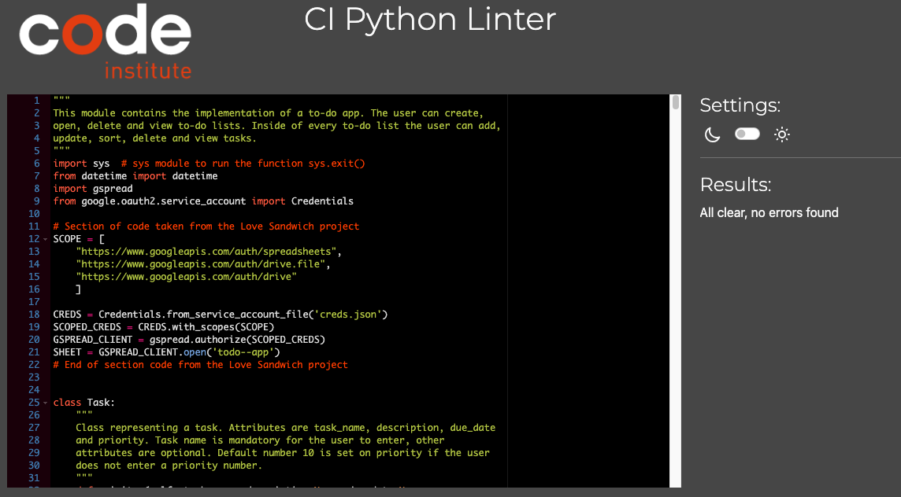

# ToDo App

The to-do app is a digital tool designed to help users organize and manage their tasks. It allows users to create, edit, and delete tasks, and set due dates and priorities.

Here you find the [deployed site](https://todo--app-bd22256d01b5.herokuapp.com/)

## Flowchart
The flowchart below, constructed using [draw.io](https://app.diagrams.net/), illustrates the planning process for this application.

## Design

The design of the user interface was constrained due to its simplicity, as this is a basic terminal-based application.

The code for the title of the app is generated by [Patorjk](https://patorjk.com/software/taag/#p=display&c=echo&f=Alpha&t=Todo%20App)

## Program goal
The goal of the program is to provide the user with a tool to create to-do lists and manage the tasks in every to-do list. The program aims to provide users with a tool for creating and managing to-do lists, enabling effective task management within each list.

## User stories
As a user, I want to:
- be able to create a new to-do list so that I can organize and categorize my tasks based on different projects or priorities.
- add tasks to my to-do lists, specifying details such as task name, description, due date, and priority, to keep track of what needs to be done.
- have the ability to view all tasks within a specific to-do list so that I can have a comprehensive overview of my pending tasks.
- edit existing tasks, allowing me to update details like task name, description, due date, or priority, ensuring my to-do list remains accurate and up-to-date.
- have the option to delete tasks that are no longer relevant or necessary, maintaining the cleanliness and relevance of my to-do list.
- be able to sort tasks within a to-do list based on different criteria, such as due date or priority, to help me prioritize and manage my tasks more efficiently.
- be able to create multiple to-do lists to organize tasks for different aspects of my life, work, or personal projects.

As a site administrator, I want to:
- have the capability to modify the application and provide users with a tool for effectively organizing and managing tasks within lists.

## Features and organizational structure
The code organizes its functionality into classes, including Task, TaskHandler, Sheet, WorksheetHandler, UserInputHandler, and TodoList, each dedicated to managing specific aspects of the application.

### Clear Instructions
The application offers instructions guiding the user on how to create and effectively manage a to-do list. The instructions aim to make the process intuitive and user-friendly.

### Data Validation
Data validation mechanisms are implemented to ensure that user inputs are accurate and within the expected format. This helps prevent errors and enhances the overall user experience by guiding them to enter valid information.

#### Example of date validation

#### Example of invalid input handling

### WorksheetHandler Class
The main functionality is encapsulated within the WorksheetHandler class, which controls the overall flow of the application. This includes creating, opening, and deleting worksheets.

### Dependency on Google Sheets:
To interact with Google Sheets, the application relies on the gspread library. OAuth2 credentials (creds.json) are utilized for secure authentication.

### Error Handling
The code incorporates error-handling mechanisms to manage unexpected situations. Error messages are provided to the user, offering guidance on how to address issues or providing alternatives to proceed. The code includes try-except blocks for handling exceptions such as gspread.exceptions and ValueError, ensuring error management.

### User Input Handling
The class is responsible for collecting user input for tasks like creating, opening, viewing, and deleting to-do lists. Additionally, this class manages user input related to tasks, such as adding, updating, sorting, and deleting tasks.

### Task Handling
The TaskHandler class is dedicated to managing tasks within a worksheet. Its responsibilities include loading tasks from the worksheet, displaying tasks, adding tasks, updating tasks, sorting, viewing, and deleting tasks.

### TodoList Class
The TodoList class serves as a user interface for interacting with tasks. It presents options for users to add, update, sort, delete, and view tasks.

### Main Function
The main function initializes essential components and initiates the worksheet loop to control the application's execution.

### Exit Strategy
In the event of errors or when users decide to quit their current activity, the code employs the statement print('Going back to the main menu') self.worksheet_handler.start_worksheet_loop() to facilitate a transition back to the main menu.

### Structured Data Handling
To represent tasks, the code utilizes a Task class, incorporating attributes like task name, description, due date, and priority for effective data organization.

### Create todo-list

### Open a todo-list

### Display current todo-lists

### Delete a todo-list

### Add task

### Update task

### Delete task

### Possible Future Features
#### Future user stories
As a user, I want to
- mark tasks as completed so that I can easily track my progress and identify the tasks that still need attention.
- receive notifications or reminders for upcoming tasks or deadlines to help me stay on top of my responsibilities.
- sort the tasks by calculating the urgency
- have the option to share my to-do lists with others, facilitating collaboration and coordination on shared projects or tasks.
- be able to integrate the tasks with calendar apps to sync tasks and deadlines.

As a site administrator, I want to
- have the ability to manage users, add or remove members, and control access to specific to-do lists.
- offer the ability for the user to sort tasks by urgency and save and update worksheet with task urgency accordingly.
- track and provide insights into user activity, such as completed tasks, common categories, and peak usage times.
- implement a data backup system for administrators to safeguard user data, along with a recovery mechanism in case of accidental deletions or data loss.
- Refactor code even more.

## Language, libraries and packages used
- Language: Python
- [gspread](https://docs.gspread.org/en/v5.12.0/) Google API for GoogleSheets
- [google.oauth2.service_account](https://google-auth.readthedocs.io/en/master/reference/google.oauth2.service_account.html) provides functionality for working with Google Cloud service accounts. Service accounts are special Google accounts that belong to the application, rather than to an individual end user.
- [Sys.exit](https://docs.python.org/3/library/sys.html) to exit the program
- [Datetime](https://docs.python.org/3/library/datetime.html) for manipulating dates and times

### Other tools
- [GitHub](https://github.com/) Used to host the application source code.
- [Gitpod](https://www.gitpod.io/) Cloud development environment to write the application source code.
- [Heroku](www.heroku.com) Used to host the application
- [Draw.io](https://app.diagrams.net/) Used to make flowcharts

## Testing

### Automated testing
Automated testing was performed using [Code Institutet's Python linter](https://pep8ci.herokuapp.com/) to check the code. The file run.py revealed no errors or warnings in the code.

Code Institutet's Python linter:

[Google Lighthouse](https://chromewebstore.google.com/detail/lighthouse/blipmdconlkpinefehnmjammfjpmpbjk?hl=sv&pli=1) results

### Browser Testing
Verification of consistent program functionality across major browsers, including Google Chrome and Mozilla Firefox, has been successful. However, the program is not performing as expected in Safari. Further investigation and adjustments are needed to ensure compatibility in Safari.

### Manual testing
The code has been extensively tested on both the local terminal and the simulated terminal on the deployed Heroku site. Deliberate entry of invalid inputs was done during testing, such as wrong due date format, strings instead of integers, or already existing to-do list when trying to create a new to-do list. The app was navigated through while many different options were experimented with.

### Unfixed Bugs
The program is not performing as expected in Safari. No other identified and unfixed bugs.

## Deployment

This project was deployed using Code Insitute's Essentials Template for Heroku. For the program to run with the
- Visit Heroku and set up a profile if you haven't already.
- Click on the "New" button located in the upper right corner, then select "Create New App" from the ensuing menu.
- Provide name for your application and choose the region (Europe). Subsequently, click on the "Create App" button.
- Navigate to the "Settings" tab and scroll down to the "Config Vars" section.
- Click on "Reveal Config Vars" and add "PORT" to the Key field and "8000" to the Value field. Afterward, click "Add."
- Include "CREDS" in the Key field and input your credentials in the Value field if applicable.
- Under "Buildpacks," click on "Add Buildpack," choose "Python," and save the selection. Repeat this process for Node.js in the correct sequence.
- Return to the top and select the "Deploy" tab.
- Opt for GitHub as the deployment method and authorize the connection.
- Search for your repository and establish the connection.
- At the bottom, choose your preferred deployment type.
- Opt for "Enable Automatic Deploys" to deploy automatically when there are pushes on GitHub, or select manual deployment.

## Credits

### Code from

Method validate_due_date() comes from code at [datatest](https://datatest.readthedocs.io/en/stable/how-to/date-time-str.html) and [digital ocean](https://www.digitalocean.com/community/tutorials/python-string-to-datetime-strptime).

Learned about sorting with lambda functions through [Free code camp](https://www.freecodecamp.org/news/python-lambda-functions//)

The utilization of the [Code Institute p3-template](https://github.com/Code-Institute-Org/p3-template) facilitated the development of this project. This template includes the necessary code to enable the execution of my Python run.py within a console window embedded in a web page.
The tasks of activating API credentials, establishing a connection to the API, and importing the gspread library were accomplished by following the Love Sandwiches walkthrough provided by Code Institute.

### Acknowledgements
In shaping the trajectory of this project, I owe credit to my respected mentor, Jad Mokdad, whose crucial guidance and wise counsel have been instrumental. His perceptive advice has not only illuminated the path for me to focus my efforts but has also offered guidance for optimal impact and success.

